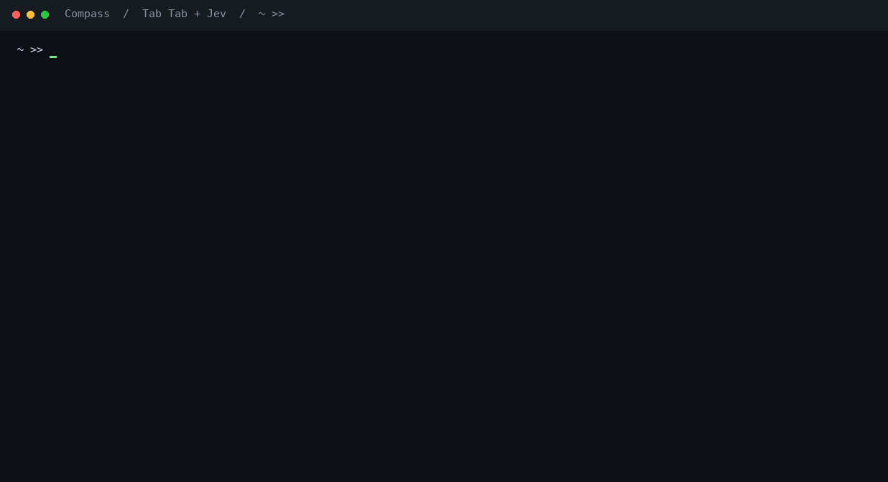

<div align="center">

# 🧭 Compass

### Find the command. Keep your autocomplete.

Browse your **native completions**, then ask **Jev** in plain English, with help from **shell history** and **local CLI help**.

[](https://github.com/ring29-labs/compass/actions/workflows/test.yml)
[](https://www.python.org/)
[](LICENSE)

</div>

You know what you want to do. Your CLI gives you hundreds of options.
Compass helps you find the command in plain language, then puts your selection
back into the shell so you can review and run it.



*Recorded in a real zsh session using the AWS CLI's native completer and live Jev,
with a neutral `~ >>` prompt. Personal history is excluded. Suggested AWS commands
are inserted for review and never executed.*

## Get started

Requires **Python 3.10+** and **zsh** on macOS or Linux. No runtime dependencies.

```sh
mkdir -p ~/.local/share
git clone https://github.com/ring29-labs/compass.git ~/.local/share/compass
export TYPESAFE_API_KEY='your-typesafe-api-key'
source ~/.local/share/compass/shell/compass.zsh
```

Use your actual [TypeSafe API key](https://typesafe.ai/). You can try the complete
flow without a key by setting `export COMPASS_OFFLINE=1`; offline ranking uses
keywords rather than Jev's understanding of your request.

To load Compass in future terminals, add this line to `~/.zshrc`:

```sh
source "$HOME/.local/share/compass/shell/compass.zsh"
```

Source Compass after your completion plugins. The key is read from your
environment; Compass doesn't store or print it.

## Use it

Type `aws ec2 ` and press **Tab twice**. The first Tab performs your normal
completion. The second opens Compass with the shell's completion choices.
You can browse them, type a command name to filter, or type a request such as
“list all instances in table format” and press Enter to ask Jev.

```text
~ >> aws ec2

  Type to filter completions, or ask in plain English
  > list all instances in table format

  aws ec2 describe-instances --query 'Reservations[].Instances[].{…}' --output table
```

Want to correct yourself? Press **Ctrl-X, followed by plain R**:

```text
  Previous request: list all instances in table format
  Correction or follow-up?
  > actually only with tag Environment=prod
```

| Key | Action |
| --- | --- |
| Tab in zsh | Your existing shell completion |
| Second consecutive Tab in zsh | Completion menu with a plain-English input |
| Type in the completion menu | Filter choices locally; Enter asks Compass |
| ↓ / Tab, then Enter in the menu | Insert a completion choice |
| Ctrl-X, then C | Start a new Compass conversation |
| Ctrl-X, then R | Resume the last Compass conversation in this terminal |
| ↑ / ↓ or 1–8 in results | Choose a result |
| Enter | Search, or insert the selected command |
| `/` in results | Add a follow-up |
| `e` in results | Edit the last request |
| Esc | Return to the shell without changing its command line |

**Choosing a suggestion never executes it.** Review the inserted command and
press Enter in your shell when you're ready.

Ctrl-Space is left available for your system's keyboard language switcher.
The original Ctrl-X, Ctrl-A and Ctrl-X, Ctrl-R shortcuts also continue to work.
Ctrl-X, then plain C opens the request prompt directly; release Ctrl before C.
To keep native double-Tab as well, set `export COMPASS_DOUBLE_TAB=0` before sourcing
Compass. The combined double-Tab menu is currently available in zsh; Bash uses
the explicit shortcuts.

Conversations retain the last six turns, including earlier suggestions and your
selected command. They stay in this shell's memory and disappear when it exits.
Resume keeps the original CLI and explicit context flags. Start a new conversation
to change CLI, account, region, or context.

## Examples

```sh
# Standalone suggestions; omit --offline to use Jev.
~/.local/share/compass/bin/compass --offline --buffer 'aws ec2' 'list all ec2 with tag nitro'
~/.local/share/compass/bin/compass --offline --buffer 'aws ec2' 'list all instances in table format'
~/.local/share/compass/bin/compass --offline --buffer kubectl 'list pods in all namespaces with label app=nitro'
~/.local/share/compass/bin/compass --offline --buffer 'az vm' 'list virtual machines with their tags'

# Keep an explicit AWS scope.
~/.local/share/compass/bin/compass --buffer 'aws ec2 --profile staging --region eu-west-1' 'list all instances'
```

| CLI | Included recipes |
| --- | --- |
| AWS | EC2 instances, tags, S3 buckets, ECS/EKS clusters, Lambda functions |
| Kubernetes | Pods, deployments, services, nodes, namespaces, configmaps, jobs, labels and contexts |
| Azure | Virtual machines, tags, resource groups, AKS clusters and subscriptions |
| Other CLIs | Commands from their installed help and relevant shell history |

For EC2, “all” means all paginated results in the selected **region and profile**.
For `tag nitro`, Compass offers a tag key named `nitro` and a tag value `nitro` under
any key. Use `tag Environment=prod` for an explicit key/value pair.

For EC2, “in table format” offers a flat table with ID, Name, State and Type.
“With all tags in table format” adds a column of `key=value` pairs. A follow-up
such as “actually use JSON format” changes the output while retaining the tag
filter. An explicit `--output` in your starting command takes precedence.

## How it works

1. Show native completion choices locally when you press Tab twice.
2. After you submit a request, read recipes, relevant history, and local CLI help.
3. Deduplicate and narrow those commands, including native completion choices.
4. Ask Jev to rank candidates and check whether any serves the request.
5. Show suggestions, or expand a matching command group and search its help.
6. Return your selection to the editable command line.

Jev makes typed decisions; it doesn't generate arbitrary command text. Literal
tags and selectors are copied from your request into recipes and shell-quoted.
Only explicit searches call the API; there are no calls on every keystroke.
Opening or filtering the completion menu does not call Jev. If a native provider
is unavailable, the menu falls back to local help, recipes, and history.

## Current limits

- **Start with a CLI prefix.** Blank-prompt requests such as “list files here”
  aren't supported yet.
- **Python project discovery isn't implemented.** Compass doesn't locate or write
  tests for an arbitrary function such as `xyz`.
- Double-Tab opens Compass at the end of a simple CLI command. Blank prompts,
  pipelines, and shell expressions keep native completion behavior.
- Other CLIs can supply native completions, command paths or history entries; required
  arguments and complex filters may need manual filling.
- zsh is the tested shell integration. Bash 4+ has a widget using the same
  shortcuts; Fish and PowerShell do not yet have widgets.
- Offline mode handles literal values and keyword matching. Semantic corrections
  use Jev. Missing keys and API failures are clearly labeled and fall back locally.

## Privacy and configuration

Online mode sends your request, previous conversation turns, and shortlisted
commands—including relevant history—to TypeSafe. Likely secrets are excluded
using conservative checks; detection is best-effort.

```sh
export COMPASS_NO_HISTORY=1  # Exclude shell history; your Compass conversation remains available.
export COMPASS_OFFLINE=1     # Run without TypeSafe API requests.
```

History is scoped to the CLI and command path. The shell widgets use private
temporary files and remove them on return. Help is cached locally for 24 hours.
Compass's retrieval uses local help and saved commands. Existing native completion
providers run as they normally would in your shell.
Use `--no-help` to skip local help execution, or `--no-history` to exclude history
from a standalone invocation.

See [advanced usage](docs/usage.md) for Bash, custom shortcuts, context flags,
standalone sessions, and the ranking details.

## Develop and contribute

```sh
git clone https://github.com/ring29-labs/compass.git
cd compass
python3 -m unittest discover -s tests -v
zsh -n shell/compass.zsh
bash -n shell/compass.bash
```

The terminal tests use a real zsh, a fake AWS CLI and native completion functions
to verify single-Tab behavior, double-Tab browsing, filtering, plain-English search,
conversation resume, cancellation, and command insertion without execution.
See [CONTRIBUTING.md](CONTRIBUTING.md) for adding recipes and help parsers, and
[the demo guide](docs/demo.md) for reproducing the recording.

## Credits

Inspired by [awesome-jev](https://github.com/yibie/awesome-jev) and
[Jev shell history](https://www.shipwithjev.com/builds/jev-shell-history).
The implementation uses the [TypeSafe HTTP API](https://docs.typesafe.ai/api).

Independent project by [ring29-labs](https://github.com/ring29-labs),
unaffiliated with TypeSafe or the linked builds. [MIT licensed](LICENSE).
